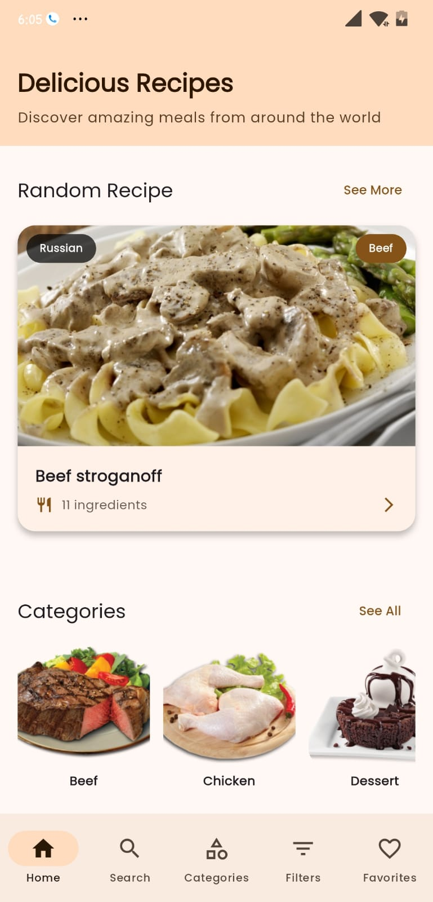
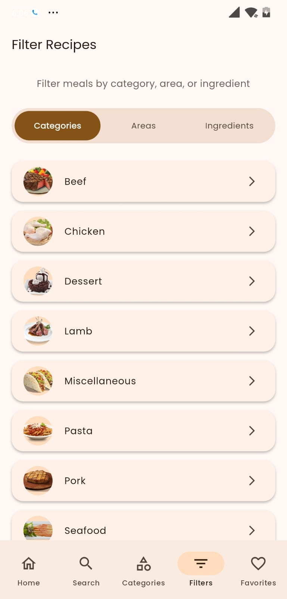
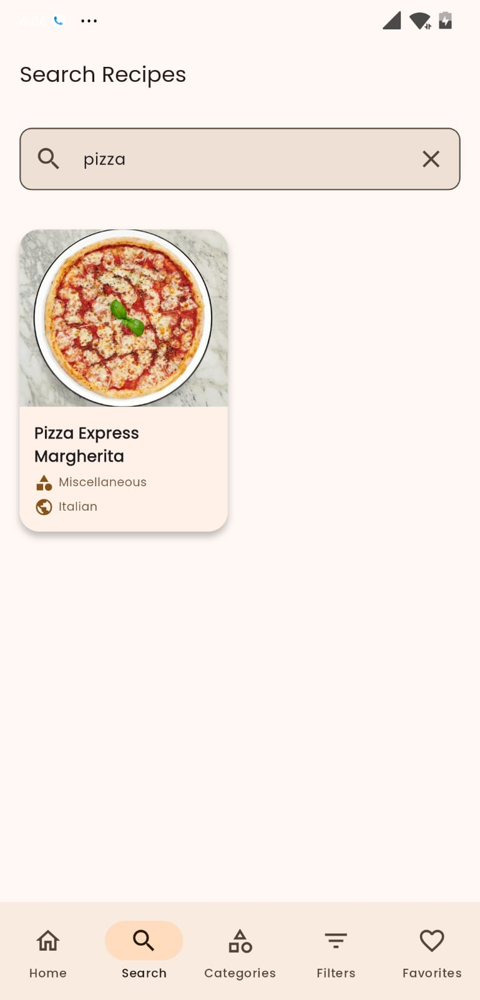
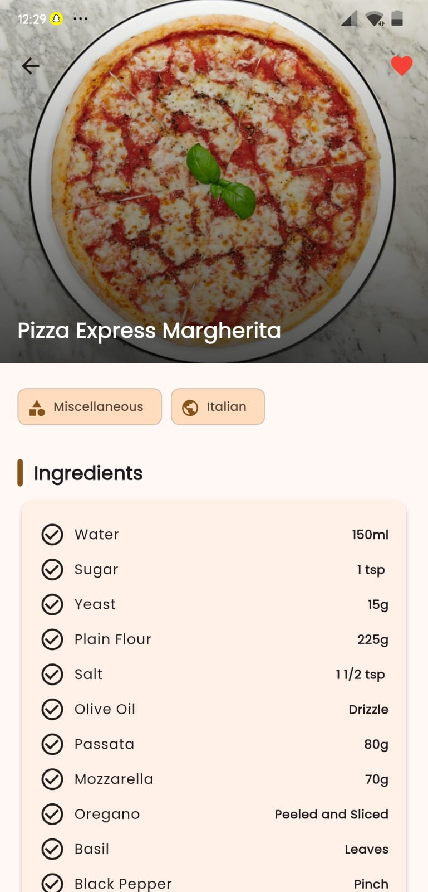
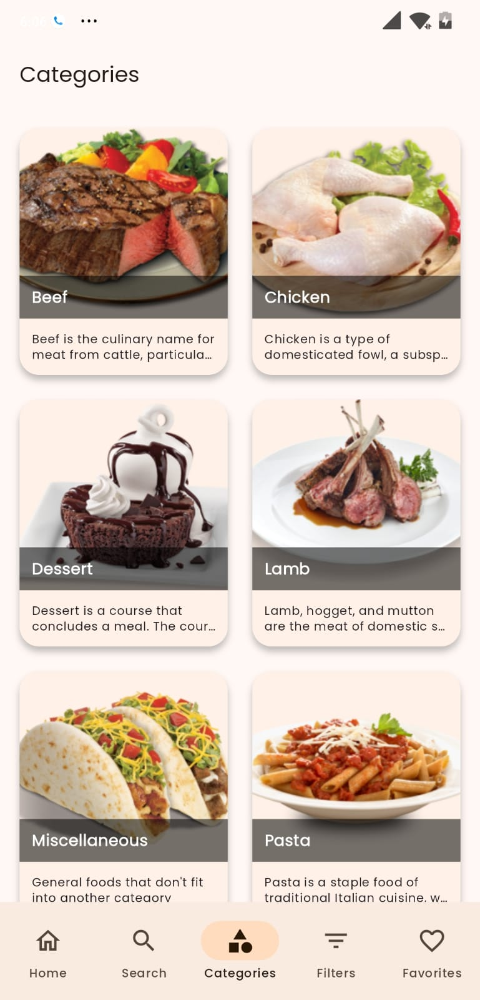
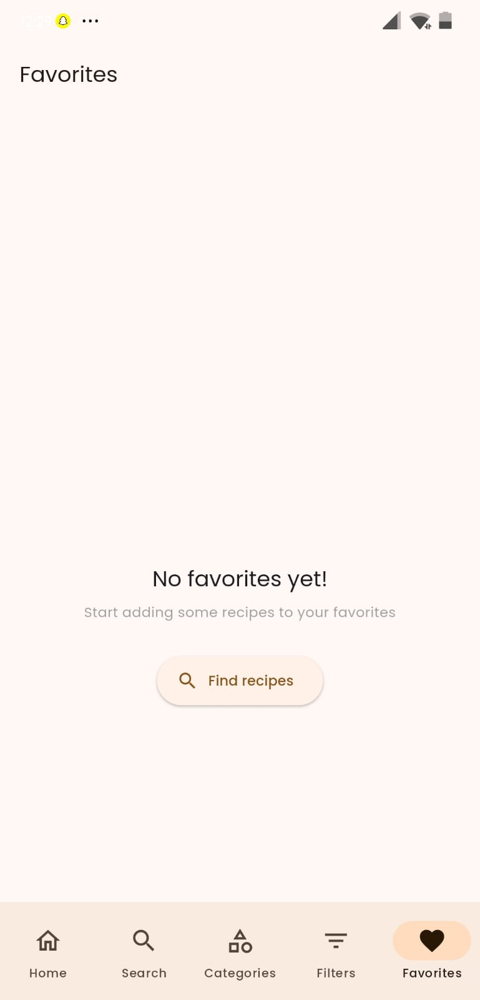

# Recipe Meal App

A Flutter application that uses TheMealDB API to display recipes from around the world.

## Features

- **Search Recipes**: Search for recipes by name
- **Random Recipe**: Get a random recipe suggestion
- **Categories**: Browse recipes by category
- **Filter Options**: Filter by ingredients, cuisine areas, or categories
- **Favorites**: Save your favorite recipes
- **Dynamic Colors**: Supports Material You theming on Android 12+
- **Dark Mode**: Automatically adapts to your device theme
- **Animated UI**: Smooth animations for a better user experience

## Getting Started

### ScreenShots
<p align="center">
  
  
  
</p>
<p align="center">
  
  
  
</p>

### Prerequisites

- Flutter SDK installed
- Android Studio / VS Code with Flutter plugins
- An emulator or a physical device for testing

### Installation

1. Clone the repository:
   ```
   git clone https://github.com/madhavbhayani/recipes.git
   ```

2. Navigate to the project folder:
   ```
   cd recipe_app
   ```

3. Get dependencies:
   ```
   flutter pub get
   ```

4. Run the app:
   ```
   flutter run
   ```

## API

This app uses [TheMealDB API](https://www.themealdb.com/api.php) to fetch recipes data.

## Libraries and Tools Used

- Provider - State management
- HTTP - API calls
- Dynamic Color - Material You theming
- Google Fonts - Typography
- Flutter Animate - Animations
- Flutter Staggered Animations - Grid animations
- Shimmer - Loading effects
- Carousel Slider - Image carousels
- Animated Text Kit - Text animations
- URL Launcher - Opening links
- Lottie - Lottie animations

## License

This project is licensed under the MIT License - see the LICENSE file for details.
